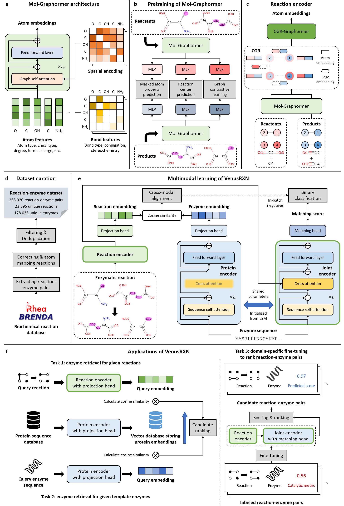

# VenusRXN: Reaction-Conditioned Enzyme Discovery with Multimodal Deep Learning
VenusRXN is a multimodal deep learning framework enabling reaction-conditioned enzyme discovery. By unifying a pre-trained reaction encoder with a protein language model through multi-task learning, VenusRXN achieves fine-grained alignment and fusion of reaction and enzyme representations. It supports fast, scalable enzyme retrieval from either reaction queries or template enzymes, and fine-tuning for task-specific enzyme recommendation. This repository contains the source code and benchmarking dataset of VenusRXN.

# Requirements
Install the dependencies according to environment.yml. It is recommended to install the packages in the following order:
```
conda install mkl=2023.1
conda install pytorch==2.5.1 torchvision==0.20.1 torchaudio==2.5.1 pytorch-cuda=12.4 -c pytorch -c nvidia
conda install lightning -c conda-forge
conda install python-lmdb -c conda-forge
conda install biopython
conda install rdkit=2024.03 -c conda-forge
conda install timeout-decorator wrapt_timeout_decorator -c conda-forge
conda install pandas
conda install openpyxl
conda install lxml
pip install torch_geometric
pip install pyg_lib torch_scatter torch_sparse torch_cluster torch_spline_conv -f https://data.pyg.org/whl/torch-2.5.0+cu124.html
pip install esm
pip install peft
pip install numba
pip install rdchiral
pip install rxnmapper
```
# Data preprocess
The reaction-enzyme dataset for model training and evaluation is in data/data.zip. Unzip it before proceeding.

Run `python preprocess_rxns.py` to preprocess reaction SMILES and cache the reaction graphs.

Parameters of `preprocess_rxns.py`:
- --rxn_smiles_path: Path to the **mapped** reaction SMILES file (csv/tsv), containing an `rxn_id` column and a `mapped_rxn` column. Defaults to `data/reactions.tsv`.
- --db_dir: Directory to save the reaction graphs. Defaults to `data/rxn_db`.

# Test enzyme retrieval performance
The script for enzyme retrieval is `enzyme_retrieval.py`. Parameters:
- --plm_name: Name of the PLM to use. For reaction-to-enzyme retrieval using VenusRXN, this should be `esmc_600m`. For enzyme-to-enzyme retrieval using a vanilla PLM, this should be one of `esm1b`, `esm2`, and `esmc_600m`. Defaults to `esmc_600m`.
- --rxn_db_dir: Directory of the preprocessed reaction graph database (output of `preprocess_rxns.py`). Defaults to `data/rxn_db`.
- --enz_db_path: Path to the protein sequence database (fasta or json mapping protein IDs to sequences). Defaults to `data/enzymes.fasta`.
- --train_ids_path: Path to the training reaction-enzyme pairs file (csv/tsv) with `rxn_id` and `enz_id` columns.
- --test_ids_path: Path to the test reaction-enzyme pairs file (csv/tsv) with `rxn_id` and `enz_id` columns.
- --ref_enzymes: If set, run enzyme-to-enzyme retrieval with template enzymes as queries. In this case, a `templates.csv` file containing the template enzyme IDs (paired with the test reaction IDs) must exist in the same directory as test_ids. Otherwise, run reaction-to-enzyme retrieval.
- --eval_batch_size: Evaluation batch size. Defaults to `80`, which is suitable for an RTX4090.
- --ckpt_path: Path to a VenusRXN checkpoint (pre-trained checkpoints will be available in future updates). Required for reaction-to-enzyme retrieval. For enzyme-to-enzyme retrieval, provide this to use VenusRXN protein embeddings; omit it to use a vanilla PLM specified by `--plm_name`.
- --overwrite: If set, re-run prediction even if cached prediction files already exist under `predictions/`.

Example: reaction-to-enzyme retrieval with VenusRXN
```
python enzyme_retrieval.py \
  --plm_name esmc_600m \
  --train_ids_path data/substrate_split/train_pairs.tsv \
  --test_ids_path data/substrate_split/test_pairs.tsv \
  --eval_batch_size 80 \
  --ckpt_path <path_to_checkpoint>
```

Example: enzyme-to-enzyme retrieval with VenusRXN
```
python enzyme_retrieval.py \
  --plm_name esmc_600m \
  --train_ids_path data/enzyme_split/train_pairs.tsv \
  --test_ids_path data/enzyme_split/test_pairs.tsv \
  --ref_enzymes \
  --eval_batch_size 80 \
  --ckpt_path <path_to_checkpoint>
```

Example: enzyme-to-enzyme retrieval with a vanilla PLM
```
python enzyme_retrieval.py \
  --plm_name esm2 \
  --train_ids_path data/enzyme_split/train_pairs.tsv \
  --test_ids_path data/enzyme_split/test_pairs.tsv \
  --ref_enzymes \
  --eval_batch_size 80
```
